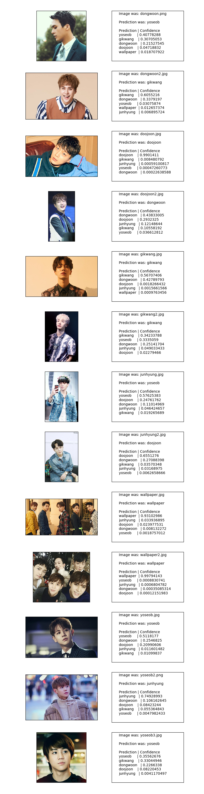

Yu-ning gave me over 600 saved photos of members of her favorite K-pop group, and I retrained Inception V3 to classify them by member. More specifically, the data was divided into 6 categories: one for each member and one to denote "wallpaper." 600 photos is not enough. The numbers came out to be about a hundred per category, but they weren't divided that evenly--for example, there were nearly 200 wallpaper photos, but there were only 41 Doojoon photos. I decided to go ahead and run it anyway. The results were as expected: less than 50% accuracy when evaluating test sets. Still, that's compared to a chance of 16.67% from guessing randomly. Unsurprisingly, the model was able to identify wallpaper images with high confidence. At first it was suspicious that the model correctly labeled the first Doojoon picture as Doojoon with a weight of 0.99. I had to double and triple check to make sure that the picture did not already exist within the training images and that the correct prediction was not just a result of overfitting. My guess is that Doojoon just puts his hand to his face a lot, or he doesn't change his hair that often, or his face looks more or less the same in all his photos. The model also did pretty well classifying Yoseob, although it utterly failed on the second picture of him. That's probably because my friend didn't include any photos of Yoseob from his latest album. 

This experiment was interesting because it wasn't simply a facial recognition project. K-pop stars pose in different ways, wear different clothes, and don different hairstyles. We always hear the phrase, "K-pop stars all look the same." If that's the case, how are their fans able to tell them apart? And what might a machine look for to tell them apart? Do their fickle outfits and hair colors help to distinguish their styles or make them all look the same? Also, I just wanted to make use of Yu-ning's handy datasets.

I could have improved on several things--namely more data... I could have allowed for random flipping/cropping of the images, I could have used a model other than Inception (maybe there exists a model out there that's better at classifying specifically humans, not just dog breeds and cars and stuff), I could have used something other than Matlab to display the results so that the formatting wouldn't look so bad. But honestly, this project was just for fun, and it's nice that it wasn't more than a day's work. 

By the way, machine learning is totally accessible, and you can do it too. Happy training :)

